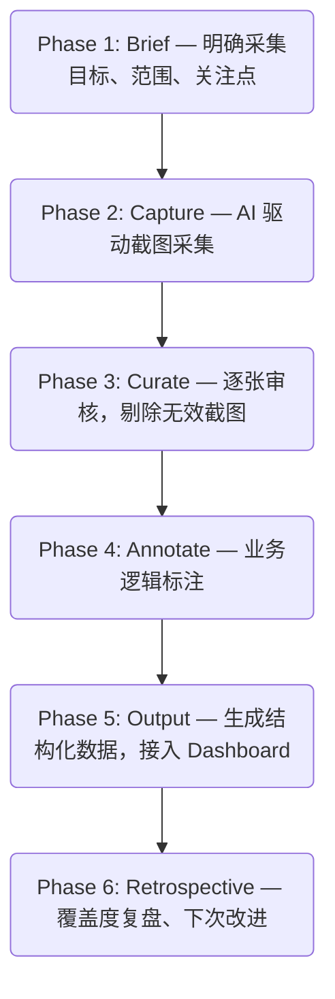

# 一、Comp-Capture Skill — 竞品截图采集


## 为什么做

竞品调研中的截图采集是一项高频但低效的工作。当前人工截图存在以下痛点：

- **效率低、耗时长：** 手动逐页截图 + 命名 + 归档，一个交易所的完整 IA 映射通常需要半天到一天
- **质量参差：** 截到加载中的骨架屏、半渲染的 K 线图、弹窗遮挡等无效截图，事后才发现需要重来
- **命名混乱：** 不同人截图命名风格不一，后期整理和查找困难
- **覆盖盲区：** 人工截图容易遗漏边缘页面和二级入口，IA 映射不完整
- **变更追踪难：** 竞品改版后无法快速 diff 出哪些页面发生了变化


## 解决了什么

`comp-capture` 是一个 Claude Code Skill，专为 UED 竞品调研场景设计。一条命令启动，AI 自动驾驶浏览器（或监听手机操作），完成截图采集、质量筛查、元数据标注和结构化输出。

<table><tbody>
<tr>
<td><b>自动化采集</b></td>
<td>AI 自动导航或监听用户操作，逐页截图并记录上下文（URL / Activity / 触发元素），全程无需手动截图和命名</td>
</tr>
<tr>
<td><b>质量把关</b></td>
<td>自动跳过骨架屏、loading spinner、动画中间帧；所有截图逐张审核，确保每一张都传递有效信息</td>
</tr>
<tr>
<td><b>结构化输出</b></td>
<td>按交易所 / 平台 / 模块自动归档，生成带元数据的 capture-log，可直接接入 dashboard</td>
</tr>
<tr>
<td><b>增量追踪</b></td>
<td>重跑时自动检测已有数据，归档旧版截图，生成变更报告（新增 / 更新 / 移除页面）</td>
</tr>
<tr>
<td><b>标注输出</b></td>
<td>为每张截图生成业务逻辑层面的 annotation，不只描述"这是什么页面"，而是"这个设计决策揭示了什么"</td>
</tr>
</tbody></table>


## 采集流程概览

每次竞品截图采集遵循六阶段流程，保证从目标定义到最终输出的全链路质量：




## 两种模式 × 两个平台

<table><tbody>
<tr>
<td></td>
<td><b>Screen Mode（广度优先）</b></td>
<td><b>Flow Mode（深度优先）</b></td>
</tr>
<tr>
<td><b>目标</b></td>
<td>映射产品信息架构（IA），覆盖所有页面和模块</td>
<td>记录单条用户旅程，捕获完整任务流</td>
</tr>
<tr>
<td><b>策略</b></td>
<td>广度扫描：遍历导航、Tab、二级入口</td>
<td>深度跟踪：沿一条任务路径从头走到尾</td>
</tr>
<tr>
<td><b>截图特征</b></td>
<td>每张截图独立，描述"这是什么页面"</td>
<td>截图严格有序，描述"用户做了什么 → 看到了什么"</td>
</tr>
<tr>
<td><b>适用场景</b></td>
<td>了解竞品完整产品结构、功能清单</td>
<td>分析关键任务流设计、转化漏斗、决策节点</td>
</tr>
</tbody></table>

<table><tbody>
<tr>
<td></td>
<td><b>Web（Playwright 浏览器自动化）</b></td>
<td><b>Android（scrcpy + ADB 真机）</b></td>
</tr>
<tr>
<td><b>驱动方式</b></td>
<td>AI 自动导航 + 全页长截图</td>
<td>用户操作手机，工具自动监听触摸事件截图</td>
</tr>
<tr>
<td><b>截图类型</b></td>
<td>全页截图（含滚动内容）</td>
<td>设备视口截图</td>
</tr>
<tr>
<td><b>上下文记录</b></td>
<td>URL + 页面标题 + 触发元素</td>
<td>当前 Activity + 包名</td>
</tr>
<tr>
<td><b>特殊能力</b></td>
<td>自动关闭弹窗、等待动态内容加载、URL 批量采集</td>
<td>触摸防抖（3s）、WebSocket 数据等待（2.5s）、Activity 变化检测</td>
</tr>
</tbody></table>


## 使用场景

### 场景 1：信息架构全景映射

> 对一个交易所做完整的产品结构扫描，了解它有哪些功能模块、导航层级和页面布局。

```bash
/comp-capture okx web screen
/comp-capture binance android screen
```

**适合什么时候用：** 刚开始研究一个竞品，需要快速建立全局认知；或者竞品大版本改版后需要重新摸底。


### 场景 2：核心用户旅程录制

> 捕获用户完成某个关键任务的完整流程 — 从入口到完成的每一步操作和页面变化。

```bash
/comp-capture okx web flow spot-trade https://www.okx.com/trade-spot/btc-usdt
/comp-capture coinbase android flow first-deposit
```

**适合什么时候用：** 分析竞品某个核心功能的交互设计，比如下单流程、入金流程、KYC 流程；为设计方案寻找参考或论据。


### 场景 3：跨交易所横评对比

> 同一个任务在不同交易所分别跑一遍 Flow，统一标注标准，做结构化对比。

```bash
/comp-capture okx web flow spot-trade https://www.okx.com/trade-spot/btc-usdt
/comp-capture binance web flow spot-trade https://www.binance.com/trade/BTC_USDT
/comp-capture bitget web flow spot-trade https://www.bitget.com/spot/BTCUSDT
```

**适合什么时候用：** 改版立项时做竞品横评；评审时需要客观数据支撑设计决策。


### 场景 4：版本变更追踪

> 对已有截图数据的交易所重新采集，自动检测哪些页面新增、更新或移除。

```bash
/comp-capture binance android screen   # 重跑已有交易所
```

工具会自动：
1. 检测到 `screenshots/binance/` 下已有截图
2. 将旧截图归档到 `_archive/2026-04-30/`
3. 完成新一轮采集后，输出变更报告（新页面 / 变更页面 / 消失页面）

**适合什么时候用：** 竞品 App 更新后快速看改了什么；定期维护竞品情报库。


### 场景 5：跨平台体验对比

> 同一个交易所的 Web 和 Android 分别采集，对比不同端的功能覆盖和交互差异。

```bash
/comp-capture okx web screen
/comp-capture okx android screen
```

**适合什么时候用：** 分析竞品在不同平台的功能优先级差异、导航结构差异。


### 场景 6：特定功能深度调研

> 只关注某个功能模块（如 Earn 产品、Copy Trading），AI 在 Brief 阶段缩小采集范围。

```bash
/comp-capture binance web screen   # Brief 阶段指定只看 Earn 模块
/comp-capture bitget android flow copy-trade-setup
```

**适合什么时候用：** 针对性的功能调研，不需要全站扫描；为某个设计项目收集特定领域的竞品参考。


## 命令速查

**语法：**
```
/comp-capture <exchange> <platform> <mode> [flow-name] [url]
```

<table><tbody>
<tr>
<td><b>参数</b></td>
<td><b>可选值</b></td>
<td><b>说明</b></td>
</tr>
<tr>
<td>exchange</td>
<td>okx / binance / bitget / coinbase / ...</td>
<td>交易所名称，用于目录组织</td>
</tr>
<tr>
<td>platform</td>
<td>web / android</td>
<td>采集平台</td>
</tr>
<tr>
<td>mode</td>
<td>screen / flow</td>
<td>广度扫描 / 深度跟踪</td>
</tr>
<tr>
<td>flow-name</td>
<td>PascalCase 或 kebab-case</td>
<td>Flow 模式必填，标识流程名称</td>
</tr>
<tr>
<td>url</td>
<td>完整 URL</td>
<td>Web 端可选，指定起始页</td>
</tr>
</tbody></table>


## 截图质量标准

每张截图都经过自动 + 人工双重质检，遵循一条核心原则：

> **"这张截图是否改变了我对这个功能的理解？" — NO → 跳过，YES → 保留**

**自动拦截：**
- 骨架屏 / loading spinner / 动画中间帧
- K 线图未加载、订单簿为空白
- 弹窗/遮罩层挡住主要内容

**去重规则（不重复截图）：**
- 同一输入框键盘弹起 vs 收起
- 同一列表滚动到不同位置
- 同一表单填写不同内容
- 同一弹窗出现在不同父页面
- 深色/浅色模式的重复

**安装与环境准备：** [参考 bybit-ux-audit 插件安装指南 — 环境准备章节](https://uponly.larksuite.com/wiki/RvDEwNsVziLkCTkfC1WuesrssQe)

---


# 二、Competitor Monitor — 竞争情报平台

Comp-Capture 采集回来的数据最终汇聚到 **Competitor Monitor** — 一个面向团队的竞品情报浏览平台。不再是散落在各自电脑里的截图文件夹，而是一个可搜索、可浏览、可对比的结构化情报库。


## 三个核心 Tab

<table><tbody>
<tr>
<td><b>Tab</b></td>
<td><b>内容</b></td>
<td><b>解决什么</b></td>
</tr>
<tr>
<td><b>Updates</b></td>
<td>4 大交易所的功能更新、活动追踪、利率对比、Referral 对比</td>
<td>"竞品最近在做什么" — 定期 review 保持市场敏感度</td>
</tr>
<tr>
<td><b>Screens</b></td>
<td>按交易所 × 平台 × 模块组织的截图库，左侧 IA 树状导航 + 右侧截图 Gallery</td>
<td>"竞品的产品长什么样" — 快速浏览任意功能模块的真实界面</td>
</tr>
<tr>
<td><b>Flows</b></td>
<td>20+ 条核心用户旅程，每条包含步骤截图 + 业务逻辑标注 + 页面 URL</td>
<td>"竞品的用户怎么完成这个任务" — 逐步对比交互细节和设计决策</td>
</tr>
</tbody></table>


## 平台能力

- **4 交易所覆盖：** Binance · OKX · Bitget · Coinbase，按品牌色标识，支持筛选
- **全局搜索：** 输入功能名或关键词，跨 Screens / Flows 快速定位
- **全屏 Lightbox：** 点击截图放大查看，支持 1x–4x 缩放、拖拽平移、键盘翻页
- **树状导航 + Scroll Spy：** 左侧 IA 树实时追踪滚动位置，点击节点直达对应截图区域
- **中英双语：** 语言一键切换
- **月度时间轴：** Updates 按月归档，回溯历史情报


## 怎么在日常工作中用

<table><tbody>
<tr>
<td><b>场景</b></td>
<td><b>怎么用</b></td>
</tr>
<tr>
<td><b>设计前找竞品参考</b></td>
<td>在 Screens 搜索功能名（如 "Earn"、"Copy Trade"），直达各交易所的真实界面截图</td>
</tr>
<tr>
<td><b>评审时提供论据</b></td>
<td>在 Flows 找到对应的用户旅程，展示"竞品是怎么做的"，用截图和标注支撑设计决策</td>
</tr>
<tr>
<td><b>改版后做横评</b></td>
<td>同一功能 Flow 对比多个交易所，看步骤数、信息层级、决策节点的差异</td>
</tr>
<tr>
<td><b>团队情报同步</b></td>
<td>定期 review Updates Tab，快速了解各交易所的最新动态、活动策略和利率变化</td>
</tr>
<tr>
<td><b>横评数据参考</b></td>
<td>Yield Comparison / Referral Comparison 表格，直接获取可量化的对比数据</td>
</tr>
</tbody></table>
